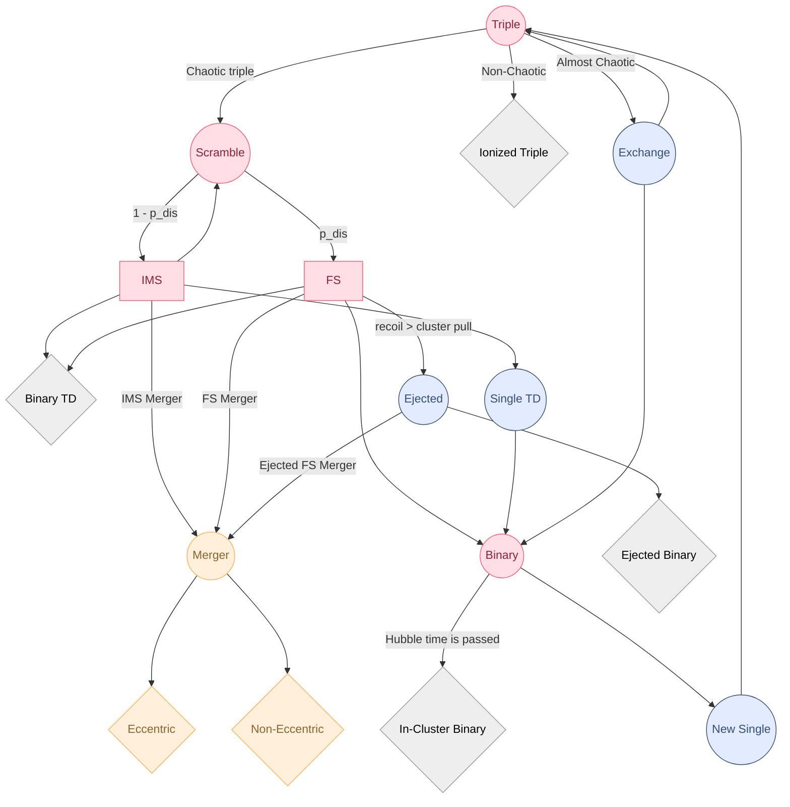

 **PROBAB3**

Created By: Dina Meylakh

# About

A command line tool to sample 3 body properties within clusters using probability density fuctions for different distributions. 

Based on the [Meylakh, Stone & Leigh 2026]() paper and many others. View all references within the paper. 

For version history and information, see the [changelog](https://github.com/dinamll9/probab3/blob/main/CHANGELOG.md).

## Sampling Algorithm Overview




# Installation

## Command Line Tool Installation

1. Install [pipx](https://github.com/pypa/pipx)

2. Install the probab3 command line tool via pipx

```
pipx install git@github.com:dinamll9/probab3.git#latest
```
*Comment*: To install a specific version, instead of latest, write the relevant version tag.

3. Check that the probab3 command line tool is installed correctly by running

```bash
  probab3 version
```

This should return in yellow:
```s
You are using probab3 version 0.1.0
```


## Python Package Installation

Optional. To use probab3 as a python package, for custom cookbooks for example, one must install it as a package via pip.

```
pip install git+https://github.com/dinamll9/probab3.git#latest
```

You can check the installation is successful by the following steps:
1. Entering a python shell:
    ```bash
    python
    ```

2. and importing the package:

    ```python
    import probab3
    ```
If no errors were encountered, the python package is successfully installed.

# Quickstart
## Running

After successful installation, you can run view probab3 commands by typing:

```bash
probab3 --help
```
This will return a list of all the available commands and their descriptions.

You can then continue to inspect probab3 command options by typing:

```bash
probab3 <command> --help
```
This will return a list of all the available options for the command and their descriptions.

After choosing a command and its options, you can run it by typing:

```bash
probab3 <command> <options>
```

## Simple Run Example

Evolve a black hole binary in a star cluster, introducing equal mass teritiary all the time and save to "example.jsonl" file.

```bash
probab3 sample-dbs --output_path "example.jsonl" equal-mass-basic --m1 10 
```

This command might take a few minutes depending on how fast your computer is and how lucky you are. You should see outputs similar to the following:

```s
You are using probab3 version 0.1.0
Starting batch of size 1
  [------------------------------------]    0% Starting evolution 1/1
evolution ended with ionized_binary after 167.96994709968567 seconds
Exporting evolution 1/1 to file example.json
  [####################################]  100%
time: 168.04273581504822
```

This will create a file named "example.json" in your current directory. You can view the metadata of this file by typing:

```bash
probab3 show-stats --input-path example.jsonl --N 0 --outcomes
```

This will return a dictionary with all the metadata of the 0th evolution and statistics of evolution ends inside the whole file like the following:

```s
You are using probab3 version 0.1.0
{'Mc': 6.289517283862093e+35,
 'alpha': 2.5,
 'end': 'ionized_binary',
 'm1': 1.9889200000000001e+31,
 'm2': 1.9889200000000001e+31,
 'm3': 1.9889200000000001e+31,
 'output_file_path': 'example.json',
 'rc': 3086000000000000.0,
 'rejection': True,
 'rh': 3.086e+16,
 'size': 1}

({'ej_binary': 0,
  'ej_fs_collision': 0,
  'ej_fs_em': 0,
  'ej_fs_merger': 0,
  'ej_fs_tde': 0,
  'fs_collision': 0,
  'fs_em_merger': 0,
  'fs_merger': 0,
  'fs_tde': 0,
  'ims_collision': 0,
  'ims_em_merger': 0,
  'ims_merger': 0,
  'ims_tde': 0,
  'in_cluster_binary': 0,
  'ionized_binary': 1.0},
 1)
```
You can also view the evolution of the system by typing:

```bash
probab3 plot --input-path example.jsonl --N 0
```

This will open up a window with a plot of the evolution of the system.


You can close the window to continue using your shell.

## Log

You can view the probab3 log file by tailing `proabab3.log`.

For example for linux baised systems:
```bash
tail -f probab3.log
```

Or for windows:
```powershell
Get-Content -Path "probab3.log" -Tail 10 -Wait
```

*Note*: The log is created in the directory the command was run in.


# Documentation

For advanced runs and more information, please visit the [documentation](https://dinamll9.github.io/probab3/).

You can find there information about:
1. [Using the command line tool](./probab3.html#command-line-usage)
2. [Using the python package in code](./probab3.html#import-usage)
3. [Running cookbooks](./probab3/cookbook.html)


# Development
In case you want to tinker with the source code or are looking to contribute, you will need to have a few more things in mind.

## Development enviornment installation

1. Make sure you have [Python](https://www.python.org/downloads/) >= 3.8.0 installed

2. Make sure you have [git](https://git-scm.com/) installed

3. Make sure you have [Poetry](https://python-poetry.org/docs/) installed

4. Clone the probab3 repository to a directory on your local computer

```bash
git clone https://github.com/dinamll9/probab3.git
```

5. Install the project dependencies with poetry
```bash
cd probab3
poetry install
```

6. Run your local repository with 

```bash
poetry run probab3 <command>
```

# Contribute
The open source license for this repository is the [MIT license](https://github.com/dinamll9/probab3/blob/main/LICENSE.md).

Bug fixes and new features are more than welcome. 

Please visit the [Contributing](./probab3.html#contributing-to-probab3) page for more information about the process.
